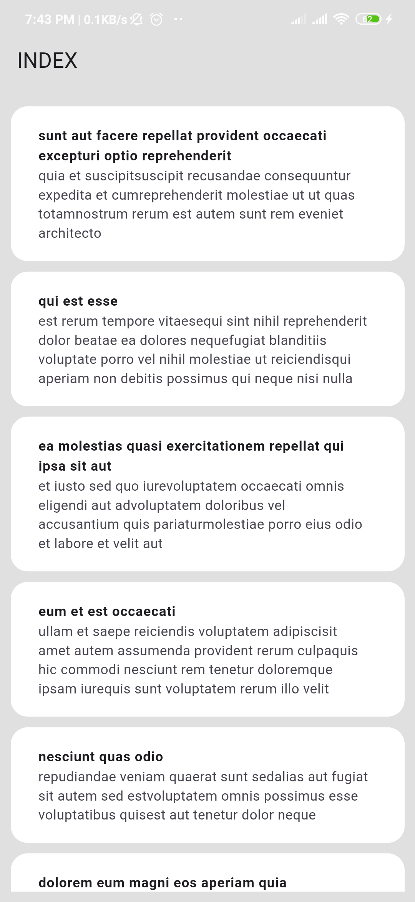
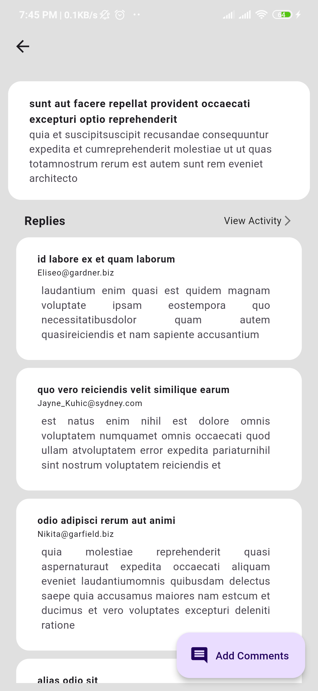
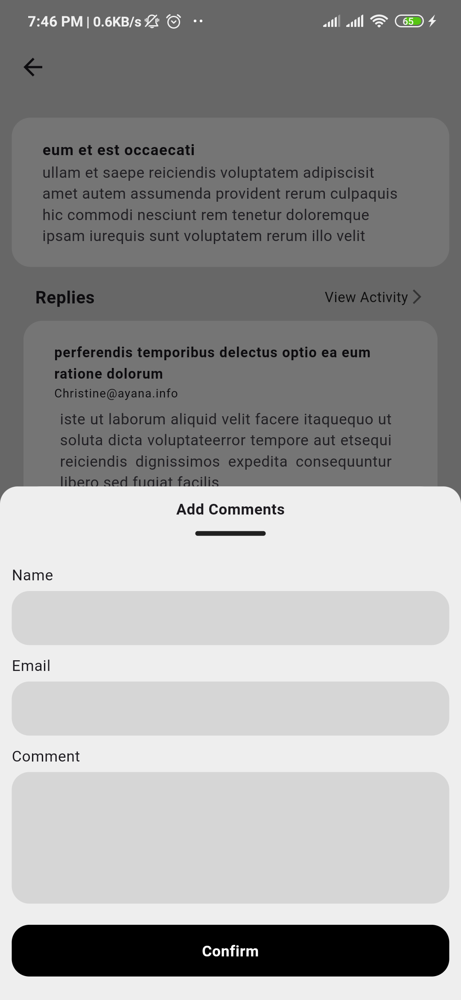

# Flutter Post Listing and Detail Showcase App

This Flutter project demonstrates a simple listing and detail showcase application using the JSONPlaceholder API. The application fetches and displays posts, shows post details along with comments, and allows users to add new comments.

## Table of Contents

- [Features](#features)
- [Screenshots](#screenshots)
- [Installation](#installation)
- [Usage](#usage)
- [Third-Party Libraries](#third-party-libraries)
- [Project Structure](#project-structure)

## Features

- **List of Posts:** Fetch and display a list of posts from the API.
- **Post Details:** Display detailed information about a post along with its comments.
- **Add Comment:** Add new comments to a post using a POST request.

## Screenshots





## Installation

1. Clone the repository:

   ```sh
   git clone https://github.com/Saw2110/techjar_task.git
   ```

2. Navigate to the project directory:

   ```sh
   cd techjar_task
   ```

3. Install the dependencies:

   ```sh
   flutter pub get
   ```

## Usage

1. Run the application:

   ```sh
   flutter run
   ```

2. Explore the list of posts.
3. Tap on a post to view its details and comments.
4. Add a new comment to a post.

## Third-Party Libraries

- [connectivity_plus: ^6.0.4](https://pub.dev/packages/connectivity_plus)
- [http: ^1.2.2](https://pub.dev/packages/http)
- [oktoast: ^3.4.0](https://pub.dev/packages/oktoast)
- [page_transition: ^2.1.0](https://pub.dev/packages/page_transition)
- [path: ^1.9.0](https://pub.dev/packages/path)
- [path_provider: ^2.1.4](https://pub.dev/packages/path_provider)
- [provider: ^6.1.2](https://pub.dev/packages/provider)
- [sqflite: ^2.3.3+1](https://pub.dev/packages/sqflite)

## Project Structure

```
lib
├─ app
│  ├─ app.dart
│  ├─ my_app.dart
│  └─ provider_wrapper.dart
├─ core
│  ├─ constant
│  │  ├─ app_api_info.dart
│  │  ├─ app_info.dart
│  │  ├─ assets_info.dart
│  │  └─ constant.dart
│  ├─ core.dart
│  ├─ extension
│  │  ├─ context_ext.dart
│  │  ├─ function_ext.dart
│  │  ├─ gap_ext.dart
│  │  ├─ padding_ext.dart
│  │  ├─ string_ext.dart
│  │  └─ toast_ext.dart
│  ├─ routes
│  │  ├─ navigation_service.dart
│  │  ├─ route_helper.dart
│  │  └─ route_info.dart
│  ├─ service
│  │  ├─ api_service.dart
│  │  └─ database
│  │     ├─ create_table.dart
│  │     ├─ database_const.dart
│  │     └─ db_service.dart
│  ├─ themes
│  │  ├─ app_colors.dart
│  │  └─ theme_config.dart
│  ├─ utils
│  │  ├─ app_validator.dart
│  │  ├─ network_check.dart
│  │  └─ snack_bar.dart
│  └─ widgets
│     ├─ alert_widget.dart
│     ├─ bottom_sheet_wrapper.dart
│     ├─ custom_button.dart
│     ├─ error_widget.dart
│     ├─ form_field
│     │  └─ app_text_form_field.dart
│     ├─ loading_widget.dart
│     └─ page_wrapper.dart
├─ main.dart
└─ src
   ├─ comments
   │  ├─ api
   │  │  └─ comment_api.dart
   │  ├─ comments.dart
   │  ├─ comment_provider.dart
   │  ├─ comment_screen.dart
   │  ├─ components
   │  │  └─ comment_info_section.dart
   │  ├─ db
   │  │  └─ comment_db.dart
   │  └─ model
   │     └─ comment_model.dart
   ├─ index
   │  ├─ index.dart
   │  └─ index_screen.dart
   ├─ posts
   │  ├─ api
   │  │  └─ post_api.dart
   │  ├─ components
   │  │  ├─ post_detail_section.dart
   │  │  └─ post_info_section.dart
   │  ├─ db
   │  │  └─ post_db.dart
   │  ├─ model
   │  │  └─ post_model.dart
   │  ├─ posts.dart
   │  ├─ post_provider.dart
   │  └─ post_screen.dart
   └─ splash
      ├─ splash.dart
      └─ splash_screen.dart
```

## API Reference

- List Posts: [https://jsonplaceholder.typicode.com/posts](https://jsonplaceholder.typicode.com/posts)
- Post Details: [https://jsonplaceholder.typicode.com/posts/{post_id}/comments](https://jsonplaceholder.typicode.com/posts/{post_id}/comments)
- Add Comment: [https://jsonplaceholder.typicode.com/posts/{post_id}/comments](https://jsonplaceholder.typicode.com/posts/{post_id}/comments)

